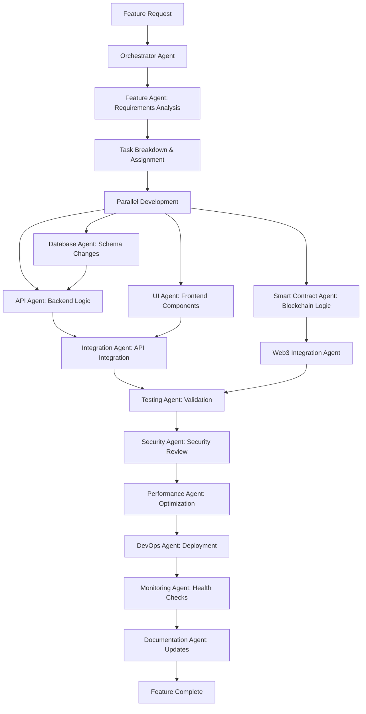
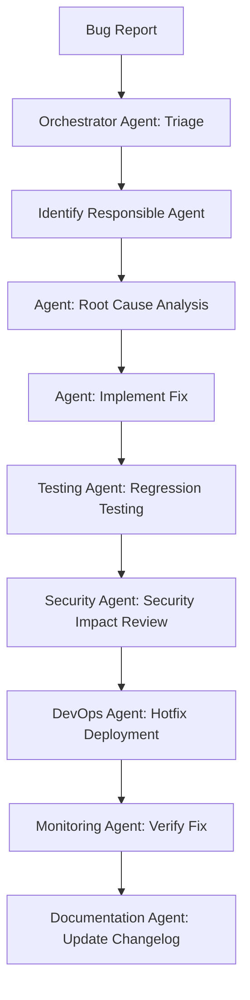
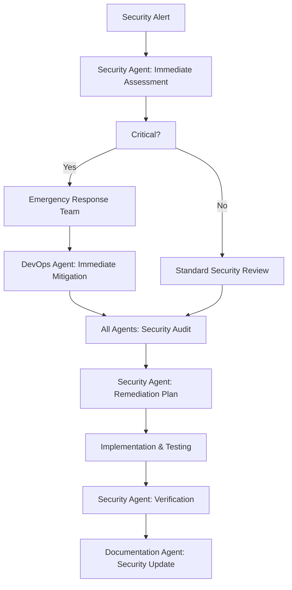

# Agent Workflow System

## Development Workflow

### 1. Feature Development Workflow



### 2. Bug Fix Workflow



### 3. Security Incident Workflow



## Task Coordination System

### Task Priority Levels

1. **P0 - Critical**: Security vulnerabilities, system outages
2. **P1 - High**: Core feature bugs, performance issues
3. **P2 - Medium**: Feature enhancements, minor bugs
4. **P3 - Low**: Documentation updates, code cleanup

### Resource Allocation Rules

- **P0 tasks**: All relevant agents drop current work
- **P1 tasks**: Agents complete current task then switch
- **P2/P3 tasks**: Normal queue processing
- **Dependency blocking**: Dependent agents wait for completion

### Conflict Resolution Protocol

1. **Resource Conflict**: Orchestrator Agent mediates based on priority
2. **Technical Disagreement**: Senior agents (Security, DevOps) have final say
3. **Scope Creep**: Feature Agent validates against requirements
4. **Performance Trade-offs**: Performance Agent makes final decision

## Agent Communication Patterns

### 1. Request-Response Pattern
```json
{
  "type": "task_request",
  "from": "orchestrator_agent",
  "to": "api_agent",
  "task_id": "feat-marketplace-search",
  "priority": "P2",
  "requirements": {
    "endpoint": "/api/v1/products/search",
    "method": "GET",
    "parameters": ["query", "category", "location"],
    "response_format": "ProductSearchResponse"
  },
  "dependencies": ["database_schema_update"],
  "deadline": "2024-12-20T10:00:00Z"
}
```

### 2. Status Update Pattern
```json
{
  "type": "status_update",
  "from": "api_agent",
  "task_id": "feat-marketplace-search",
  "status": "in_progress",
  "progress": 60,
  "estimated_completion": "2024-12-19T15:30:00Z",
  "blockers": [],
  "next_steps": ["implement pagination", "add sorting options"]
}
```

### 3. Dependency Notification Pattern
```json
{
  "type": "dependency_ready",
  "from": "database_agent",
  "to": ["api_agent", "integration_agent"],
  "task_id": "database_schema_update",
  "deliverable": {
    "migration_file": "add_product_search_indexes.py",
    "new_models": ["ProductSearchIndex"],
    "api_changes": ["search_products method signature"]
  }
}
```

## Quality Gates

### Code Quality Gates
- **Linting**: All code must pass ESLint/Black formatting
- **Type Safety**: TypeScript strict mode, Python type hints
- **Test Coverage**: Minimum 80% coverage for new code
- **Security Scan**: No high/critical vulnerabilities
- **Performance**: API responses < 200ms, bundle size < 500KB

### Review Gates
- **Peer Review**: Related agents review each other's code
- **Security Review**: Security Agent reviews all changes
- **Architecture Review**: Orchestrator reviews major changes
- **Documentation Review**: Documentation Agent reviews all updates

## Automation Rules

### Automated Actions
- **Code Formatting**: Auto-format on commit
- **Test Execution**: Run tests on PR creation
- **Security Scanning**: Scan on every commit
- **Deployment**: Auto-deploy on main branch merge
- **Monitoring**: Auto-alert on performance degradation

### Manual Approval Required
- Database schema changes
- Security-related modifications
- Infrastructure changes
- Breaking API changes
- Production deployments

## Success Metrics & KPIs

### Development Velocity
- **Story Points**: Completed per sprint
- **Cycle Time**: Requirement to deployment
- **Lead Time**: Idea to production
- **Deployment Frequency**: Releases per week

### Quality Metrics
- **Bug Rate**: Bugs per feature
- **Test Coverage**: Percentage of code covered
- **Security Score**: Vulnerability count and severity
- **Performance Score**: Core Web Vitals, API response times

### Collaboration Metrics
- **Agent Utilization**: Percentage of time agents are productive
- **Conflict Rate**: Number of conflicts requiring orchestrator intervention
- **Dependency Wait Time**: Time agents wait for dependencies
- **Knowledge Sharing**: Documentation updates per feature

## Emergency Procedures

### System Outage Response
1. **Monitoring Agent**: Detect and alert
2. **DevOps Agent**: Immediate investigation
3. **Orchestrator Agent**: Coordinate response team
4. **All Agents**: Drop non-critical work
5. **Security Agent**: Assess security implications
6. **Documentation Agent**: Update incident log

### Data Breach Response
1. **Security Agent**: Lead incident response
2. **DevOps Agent**: Isolate affected systems
3. **Database Agent**: Assess data exposure
4. **API Agent**: Implement emergency access controls
5. **Documentation Agent**: Maintain incident timeline
6. **Feature Agent**: Coordinate user communication
