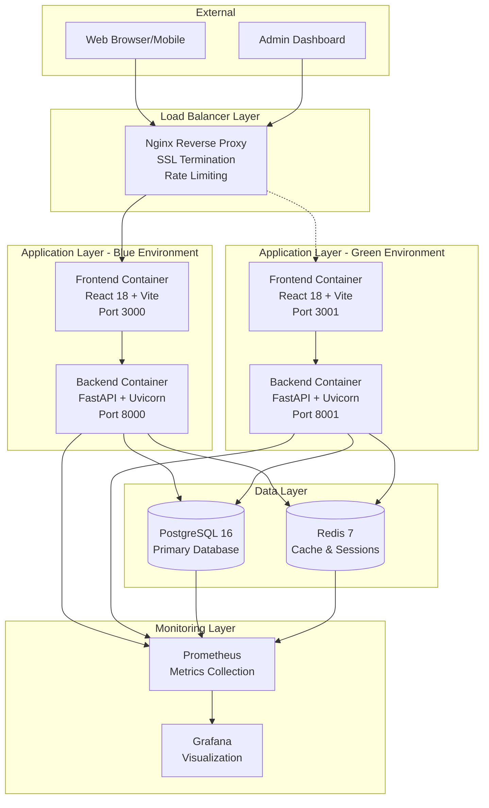
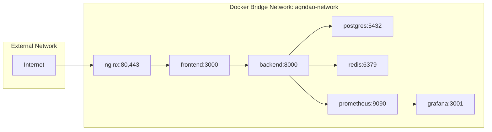

# Design Document: AgriDAO MVP Docker Finalization

## Overview

This design document outlines the comprehensive Docker-based deployment architecture for the AgriDAO MVP. The system consists of a React 18 frontend, FastAPI backend, PostgreSQL database, Redis cache, and supporting infrastructure services (Nginx, Prometheus, Grafana). The design emphasizes production readiness, zero-downtime deployments, comprehensive monitoring, and developer experience optimization.

### Design Goals

1. **Production Readiness**: Enterprise-grade security, performance, and reliability
2. **Zero-Downtime Deployments**: Blue-green deployment strategy with automated rollback
3. **Developer Experience**: Fast iteration cycles with hot-reload and easy setup
4. **Observability**: Comprehensive monitoring, logging, and alerting
5. **Scalability**: Horizontal scaling support for all stateless services
6. **Security**: Defense-in-depth with multiple security layers
7. **Maintainability**: Clear documentation and automated operations

## Architecture

### System Architecture Diagram



### Container Architecture

#### Frontend Container (React + Vite)
- **Base Image**: node:18-alpine (multi-stage build)
- **Build Stage**: Compile TypeScript, bundle with Vite, optimize assets
- **Runtime Stage**: Serve static files with lightweight HTTP server
- **Size Target**: < 100MB
- **Ports**: 3000 (blue), 3001 (green)
- **Health Check**: HTTP GET / returns 200

#### Backend Container (FastAPI)
- **Base Image**: python:3.11-slim
- **Dependencies**: FastAPI, SQLModel, Alembic, Redis, Stripe SDK
- **Runtime**: Uvicorn with 4 workers (configurable)
- **Ports**: 8000 (blue), 8001 (green)
- **Health Check**: HTTP GET /health returns {"status": "healthy"}
- **User**: Non-root user 'app' (UID 1001)

#### Database Container (PostgreSQL)
- **Base Image**: postgres:16
- **Extensions**: uuid-ossp, pg_trgm (for full-text search)
- **Volume**: postgres_data (persistent)
- **Port**: 5432
- **Health Check**: pg_isready command
- **Backup Strategy**: Daily automated dumps + WAL archiving

#### Cache Container (Redis)
- **Base Image**: redis:7-alpine
- **Persistence**: AOF (Append-Only File) enabled
- **Volume**: redis_data (persistent)
- **Port**: 6379
- **Health Check**: redis-cli ping returns PONG
- **Configuration**: maxmemory-policy allkeys-lru

#### Nginx Container
- **Base Image**: nginx:alpine
- **Configuration**: Custom nginx.conf with security headers
- **SSL**: TLS 1.2+ with strong ciphers
- **Ports**: 80 (HTTP redirect), 443 (HTTPS)
- **Features**: Rate limiting, gzip compression, static caching

#### Monitoring Containers
- **Prometheus**: Metrics collection every 15s, 30-day retention
- **Grafana**: Pre-configured dashboards for system health

### Network Architecture



**Network Configuration:**
- **Bridge Network**: `agridao-network` with automatic DNS resolution
- **Service Discovery**: Containers communicate via service names (e.g., `backend:8000`)
- **Port Mapping**: Only Nginx ports (80, 443) exposed to host
- **Internal Communication**: All inter-service traffic stays within Docker network

## Components and Interfaces

### 1. Docker Compose Configuration

#### Development Environment (`docker-compose.yml`)

```yaml
services:
  db:
    image: postgres:16
    restart: unless-stopped
    environment:
      POSTGRES_USER: postgres
      POSTGRES_PASSWORD: postgres
      POSTGRES_DB: agridb
    ports:
      - "5432:5432"  # Exposed for local development tools
    volumes:
      - pgdata:/var/lib/postgresql/data
    healthcheck:
      test: ["CMD-SHELL", "pg_isready -U postgres"]
      interval: 10s
      timeout: 5s
      retries: 5

  redis:
    image: redis:7-alpine
    restart: unless-stopped
    ports:
      - "6379:6379"  # Exposed for local Redis CLI
    volumes:
      - redisdata:/data
    command: ["redis-server", "--appendonly", "yes"]
    healthcheck:
      test: ["CMD", "redis-cli", "ping"]
      interval: 10s
      timeout: 3s
      retries: 5

  backend:
    build:
      context: ./backend
      dockerfile: Dockerfile
    env_file:
      - ./backend/.env
    environment:
      - DATABASE_URL=postgresql://postgres:postgres@db:5432/agridb
      - REDIS_URL=redis://redis:6379/0
      - LOG_LEVEL=DEBUG
    depends_on:
      db:
        condition: service_healthy
      redis:
        condition: service_healthy
    ports:
      - "8000:8000"
    volumes:
      - ./backend:/app  # Hot-reload for development
    command: ["uvicorn", "app.main:app", "--host", "0.0.0.0", "--port", "8000", "--reload"]

volumes:
  pgdata:
  redisdata:
```

#### Production Environment (`docker-compose.prod.yml`)

```yaml
services:
  app:
    build:
      context: .
      dockerfile: Dockerfile.prod
      args:
        - NODE_ENV=production
    environment:
      - NODE_ENV=production
      - DATABASE_URL=${DATABASE_URL}
      - REDIS_URL=redis://redis:6379
      - JWT_SECRET=${JWT_SECRET}
      - STRIPE_SECRET_KEY=${STRIPE_SECRET_KEY}
    depends_on:
      - postgres
      - redis
    restart: unless-stopped
    networks:
      - agridao-network
    healthcheck:
      test: ["CMD", "curl", "-f", "http://localhost:3000/"]
      interval: 30s
      timeout: 10s
      retries: 3
      start_period: 40s

  postgres:
    image: postgres:16-alpine
    environment:
      - POSTGRES_USER=${POSTGRES_USER:-agridao}
      - POSTGRES_PASSWORD=${POSTGRES_PASSWORD}
      - POSTGRES_DB=${POSTGRES_DB:-agridao_prod}
    volumes:
      - postgres_data:/var/lib/postgresql/data
      - ./init.sql:/docker-entrypoint-initdb.d/init.sql
      - ./backups:/backups
    restart: unless-stopped
    networks:
      - agridao-network
    healthcheck:
      test: ["CMD-SHELL", "pg_isready -U ${POSTGRES_USER:-agridao}"]
      interval: 10s
      timeout: 5s
      retries: 5

  redis:
    image: redis:7-alpine
    command: ["redis-server", "--appendonly", "yes", "--maxmemory", "256mb", "--maxmemory-policy", "allkeys-lru"]
    volumes:
      - redis_data:/data
    restart: unless-stopped
    networks:
      - agridao-network
    healthcheck:
      test: ["CMD", "redis-cli", "ping"]
      interval: 10s
      timeout: 3s
      retries: 5

  nginx:
    image: nginx:alpine
    ports:
      - "80:80"
      - "443:443"
    volumes:
      - ./nginx.conf:/etc/nginx/nginx.conf:ro
      - ./ssl:/etc/nginx/ssl:ro
      - ./static:/usr/share/nginx/html:ro
    depends_on:
      - app
    restart: unless-stopped
    networks:
      - agridao-network
    healthcheck:
      test: ["CMD", "wget", "--quiet", "--tries=1", "--spider", "http://localhost/health"]
      interval: 30s
      timeout: 10s
      retries: 3

  prometheus:
    image: prom/prometheus:latest
    ports:
      - "9090:9090"
    volumes:
      - ./prometheus.yml:/etc/prometheus/prometheus.yml:ro
      - prometheus_data:/prometheus
    command:
      - '--config.file=/etc/prometheus/prometheus.yml'
      - '--storage.tsdb.path=/prometheus'
      - '--storage.tsdb.retention.time=30d'
      - '--web.console.libraries=/etc/prometheus/console_libraries'
      - '--web.console.templates=/etc/prometheus/consoles'
    restart: unless-stopped
    networks:
      - agridao-network

  grafana:
    image: grafana/grafana:latest
    ports:
      - "3001:3000"
    environment:
      - GF_SECURITY_ADMIN_PASSWORD=${GRAFANA_PASSWORD}
      - GF_USERS_ALLOW_SIGN_UP=false
      - GF_SERVER_ROOT_URL=https://grafana.${DOMAIN}
    volumes:
      - grafana_data:/var/lib/grafana
      - ./grafana/dashboards:/etc/grafana/provisioning/dashboards:ro
      - ./grafana/datasources:/etc/grafana/provisioning/datasources:ro
    depends_on:
      - prometheus
    restart: unless-stopped
    networks:
      - agridao-network

volumes:
  postgres_data:
    driver: local
  redis_data:
    driver: local
  prometheus_data:
    driver: local
  grafana_data:
    driver: local

networks:
  agridao-network:
    driver: bridge
    ipam:
      config:
        - subnet: 172.28.0.0/16
```

### 2. Dockerfile Configurations

#### Frontend Production Dockerfile (`Dockerfile.prod`)

```dockerfile
# Stage 1: Dependencies
FROM node:18-alpine AS deps
RUN apk add --no-cache libc6-compat
WORKDIR /app
COPY package*.json ./
RUN npm ci --only=production && npm cache clean --force

# Stage 2: Builder
FROM node:18-alpine AS builder
WORKDIR /app
COPY package*.json ./
RUN npm ci
COPY . .
ENV NODE_ENV=production
RUN npm run build

# Stage 3: Runner
FROM node:18-alpine AS runner
WORKDIR /app

ENV NODE_ENV=production
ENV PORT=3000

RUN addgroup --system --gid 1001 nodejs && \
    adduser --system --uid 1001 nextjs

COPY --from=deps --chown=nextjs:nodejs /app/node_modules ./node_modules
COPY --from=builder --chown=nextjs:nodejs /app/dist ./dist
COPY --from=builder --chown=nextjs:nodejs /app/public ./public
COPY --from=builder --chown=nextjs:nodejs /app/package.json ./package.json

USER nextjs

EXPOSE 3000

HEALTHCHECK --interval=30s --timeout=10s --start-period=40s --retries=3 \
  CMD node -e "require('http').get('http://localhost:3000/', (r) => {process.exit(r.statusCode === 200 ? 0 : 1)})"

CMD ["npm", "start"]
```

#### Backend Dockerfile (`backend/Dockerfile`)

```dockerfile
FROM python:3.11-slim

# Prevent Python from writing pyc files and buffering stdout/stderr
ENV PYTHONDONTWRITEBYTECODE=1
ENV PYTHONUNBUFFERED=1
ENV PATH="/app/.local/bin:$PATH"

WORKDIR /app

# Install system dependencies
RUN apt-get update && \
    apt-get install -y --no-install-recommends \
        build-essential \
        libpq-dev \
        curl \
    && rm -rf /var/lib/apt/lists/*

# Copy and install Python dependencies
COPY requirements.txt .
RUN pip install --no-cache-dir --upgrade pip && \
    pip install --no-cache-dir -r requirements.txt

# Copy application code
COPY . .

# Create non-root user
RUN useradd --create-home --shell /bin/bash app && \
    chown -R app:app /app

USER app

EXPOSE 8000

# Health check
HEALTHCHECK --interval=30s --timeout=30s --start-period=5s --retries=3 \
    CMD curl -f http://localhost:8000/health || exit 1

# Run migrations and start server
CMD ["sh", "-c", "alembic upgrade head && uvicorn app.main:app --host 0.0.0.0 --port 8000 --workers 4"]
```

### 3. Deployment Scripts

#### Blue-Green Deployment Script (`scripts/deploy.sh`)

**Key Features:**
- Automated backup before deployment
- Health check validation before traffic switch
- Automatic rollback on failure
- Zero-downtime deployment
- Deployment status notifications

**Workflow:**
1. Check prerequisites (Docker, environment files)
2. Create backup of database and volumes
3. Build new Docker images with version tags
4. Deploy to inactive environment (blue or green)
5. Run database migrations on new environment
6. Perform health checks (30 attempts, 10s interval)
7. Switch Nginx upstream to new environment
8. Verify traffic is flowing correctly
9. Shutdown old environment
10. Cleanup old images and containers

**Rollback Procedure:**
1. Detect deployment failure
2. Switch traffic back to old environment
3. Restore database from backup if needed
4. Shutdown failed environment
5. Log rollback details

### 4. Health Check System

#### Backend Health Endpoint (`/health`)

```python
@router.get("/health")
async def health_check():
    """Basic health check endpoint."""
    return {
        "status": "healthy",
        "timestamp": datetime.utcnow().isoformat(),
        "version": "1.0.0"
    }

@router.get("/health/detailed")
async def detailed_health_check():
    """Detailed health check with component status."""
    health_status = {
        "status": "healthy",
        "timestamp": datetime.utcnow().isoformat(),
        "components": {}
    }
    
    # Check database
    try:
        with Session(engine) as session:
            session.exec(text("SELECT 1"))
        health_status["components"]["database"] = "healthy"
    except Exception as e:
        health_status["components"]["database"] = f"unhealthy: {str(e)}"
        health_status["status"] = "degraded"
    
    # Check Redis
    try:
        await redis_service.ping()
        health_status["components"]["redis"] = "healthy"
    except Exception as e:
        health_status["components"]["redis"] = f"unhealthy: {str(e)}"
        health_status["status"] = "degraded"
    
    # Check disk space
    disk_usage = psutil.disk_usage('/')
    health_status["components"]["disk"] = {
        "total": disk_usage.total,
        "used": disk_usage.used,
        "free": disk_usage.free,
        "percent": disk_usage.percent
    }
    
    if disk_usage.percent > 90:
        health_status["status"] = "degraded"
    
    return health_status
```

#### Docker Health Check Configuration

```yaml
healthcheck:
  test: ["CMD", "curl", "-f", "http://localhost:8000/health"]
  interval: 30s
  timeout: 10s
  retries: 3
  start_period: 40s
```

### 5. Monitoring and Observability

#### Prometheus Configuration

**Scrape Targets:**
- Backend API: `/metrics` endpoint (30s interval)
- PostgreSQL: Database metrics via postgres_exporter
- Redis: Cache metrics via redis_exporter
- Nginx: Request metrics via nginx-prometheus-exporter

**Key Metrics:**
- Request rate and latency (p50, p95, p99)
- Error rate by endpoint
- Database connection pool usage
- Redis cache hit/miss ratio
- Container resource usage (CPU, memory, disk)

#### Grafana Dashboards

**System Overview Dashboard:**
- Service health status
- Request throughput
- Error rates
- Response time percentiles
- Active users

**Database Dashboard:**
- Connection pool metrics
- Query performance
- Slow query log
- Table sizes and growth
- Replication lag (if applicable)

**Application Dashboard:**
- API endpoint performance
- Authentication success/failure rates
- Order processing metrics
- Payment transaction status
- Background job queue length

## Data Models

### Environment Configuration Schema

```typescript
interface EnvironmentConfig {
  // Database
  DATABASE_URL: string;
  POSTGRES_USER: string;
  POSTGRES_PASSWORD: string;
  POSTGRES_DB: string;
  
  // Redis
  REDIS_URL: string;
  REDIS_PASSWORD?: string;
  
  // Application
  NODE_ENV: 'development' | 'staging' | 'production';
  API_BASE_URL: string;
  FRONTEND_URL: string;
  
  // Security
  JWT_SECRET: string;
  JWT_REFRESH_SECRET: string;
  ENCRYPTION_KEY: string;
  
  // External Services
  STRIPE_SECRET_KEY: string;
  STRIPE_WEBHOOK_SECRET: string;
  FIREBASE_PROJECT_ID: string;
  FIREBASE_PRIVATE_KEY: string;
  
  // Monitoring
  SENTRY_DSN?: string;
  PROMETHEUS_ENABLED: boolean;
  LOG_LEVEL: 'DEBUG' | 'INFO' | 'WARNING' | 'ERROR';
  
  // Deployment
  DEPLOY_ENVIRONMENT: 'blue' | 'green';
  BACKUP_ENABLED: boolean;
  BACKUP_RETENTION_DAYS: number;
}
```

### Docker Volume Schema

```yaml
volumes:
  postgres_data:
    driver: local
    driver_opts:
      type: none
      device: /var/lib/agridao/postgres
      o: bind
  
  redis_data:
    driver: local
    driver_opts:
      type: none
      device: /var/lib/agridao/redis
      o: bind
  
  prometheus_data:
    driver: local
    driver_opts:
      type: none
      device: /var/lib/agridao/prometheus
      o: bind
```

## Error Handling

### Deployment Error Scenarios

#### 1. Health Check Failure
**Scenario**: New environment fails health checks after deployment

**Detection**:
- Health check endpoint returns non-200 status
- 3 consecutive failures within 90 seconds

**Response**:
1. Log detailed error information
2. Capture container logs for debugging
3. Trigger automatic rollback
4. Send alert notification
5. Preserve failed environment for debugging

#### 2. Database Migration Failure
**Scenario**: Alembic migration fails during deployment

**Detection**:
- Migration command exits with non-zero status
- Database schema validation fails

**Response**:
1. Prevent backend container from starting
2. Log migration error details
3. Rollback database to previous backup
4. Alert DevOps team
5. Provide migration rollback instructions

#### 3. Container Build Failure
**Scenario**: Docker image build fails due to dependency issues

**Detection**:
- Docker build command exits with error
- Missing dependencies or compilation errors

**Response**:
1. Log build error output
2. Preserve previous working images
3. Notify development team
4. Provide dependency resolution guidance

#### 4. Network Connectivity Issues
**Scenario**: Containers cannot communicate within Docker network

**Detection**:
- Service discovery failures
- Connection timeouts between services

**Response**:
1. Verify Docker network configuration
2. Check DNS resolution within network
3. Validate port mappings
4. Restart Docker daemon if necessary

### Monitoring Alert Rules

```yaml
groups:
  - name: agridao_alerts
    interval: 30s
    rules:
      - alert: HighErrorRate
        expr: rate(http_requests_total{status=~"5.."}[5m]) > 0.05
        for: 5m
        labels:
          severity: critical
        annotations:
          summary: "High error rate detected"
          description: "Error rate is {{ $value }} errors/sec"
      
      - alert: DatabaseConnectionPoolExhausted
        expr: database_connections_active / database_connections_max > 0.9
        for: 2m
        labels:
          severity: warning
        annotations:
          summary: "Database connection pool near capacity"
      
      - alert: DiskSpaceRunningLow
        expr: disk_usage_percent > 85
        for: 10m
        labels:
          severity: warning
        annotations:
          summary: "Disk space usage above 85%"
      
      - alert: ServiceDown
        expr: up{job="agridao-app"} == 0
        for: 1m
        labels:
          severity: critical
        annotations:
          summary: "Service {{ $labels.instance }} is down"
```

## Testing Strategy

### 1. Container Testing

**Unit Tests for Dockerfiles:**
- Verify non-root user configuration
- Validate health check endpoints
- Test environment variable injection
- Confirm proper file permissions

**Integration Tests for Docker Compose:**
- Verify all services start successfully
- Test inter-service communication
- Validate volume persistence
- Confirm network isolation

### 2. Deployment Testing

**Pre-Deployment Validation:**
- Run integration test suite (`integration-test.sh`)
- Verify environment configuration
- Check SSL certificate validity
- Validate backup integrity

**Post-Deployment Validation:**
- Health check all services
- Smoke test critical user flows
- Verify monitoring data collection
- Test rollback procedure

### 3. Performance Testing

**Load Testing:**
- Simulate 1000 concurrent users
- Measure API response times under load
- Monitor resource utilization
- Identify bottlenecks

**Stress Testing:**
- Test system behavior at capacity limits
- Verify graceful degradation
- Test auto-scaling triggers
- Validate error handling under stress

### 4. Security Testing

**Container Security:**
- Scan images for vulnerabilities (Trivy, Snyk)
- Verify no secrets in images
- Test container isolation
- Validate network policies

**Application Security:**
- OWASP Top 10 compliance testing
- Penetration testing
- SSL/TLS configuration validation
- Rate limiting effectiveness

## Implementation Phases

### Phase 1: Docker Configuration Optimization (Week 1)
- Optimize Dockerfiles for production
- Implement multi-stage builds
- Configure health checks
- Set up volume management

### Phase 2: Deployment Automation (Week 1-2)
- Enhance deploy.sh script
- Implement blue-green deployment
- Create rollback procedures
- Set up backup automation

### Phase 3: Monitoring and Observability (Week 2)
- Configure Prometheus scraping
- Create Grafana dashboards
- Set up alerting rules
- Implement log aggregation

### Phase 4: Testing and Validation (Week 2-3)
- Develop integration test suite
- Create deployment validation scripts
- Perform load testing
- Conduct security audits

### Phase 5: Documentation and Training (Week 3)
- Write operational runbooks
- Create troubleshooting guides
- Document deployment procedures
- Train team on new workflows

## Security Considerations

### Container Security
- Use official base images from trusted registries
- Scan images for vulnerabilities before deployment
- Run containers as non-root users
- Implement read-only root filesystems where possible
- Use Docker secrets for sensitive data

### Network Security
- Isolate services in Docker networks
- Expose only necessary ports to host
- Implement network policies for inter-service communication
- Use TLS for all external communication

### Data Security
- Encrypt data at rest (database volumes)
- Encrypt data in transit (TLS 1.2+)
- Implement proper backup encryption
- Secure backup storage with access controls

### Access Control
- Implement RBAC for Docker daemon access
- Use separate credentials per environment
- Rotate secrets regularly
- Audit all deployment actions

## Performance Optimization

### Container Optimization
- Minimize image layers
- Use .dockerignore to exclude unnecessary files
- Implement layer caching strategies
- Use Alpine-based images where possible

### Application Optimization
- Configure appropriate worker counts (CPU cores * 2 + 1)
- Implement connection pooling for database
- Use Redis for session storage and caching
- Enable gzip compression in Nginx

### Resource Allocation
```yaml
services:
  backend:
    deploy:
      resources:
        limits:
          cpus: '2.0'
          memory: 2G
        reservations:
          cpus: '1.0'
          memory: 1G
```

## Disaster Recovery

### Backup Strategy
- **Frequency**: Daily automated backups at 2 AM UTC
- **Retention**: 30 days for daily, 12 months for monthly
- **Storage**: Off-site backup storage (S3, Azure Blob)
- **Verification**: Weekly backup restoration tests

### Recovery Procedures

**Database Recovery:**
1. Stop application services
2. Restore database from backup
3. Verify data integrity
4. Run database migrations if needed
5. Restart services

**Full System Recovery:**
1. Provision new infrastructure
2. Restore Docker volumes from backup
3. Deploy application containers
4. Verify all services healthy
5. Switch DNS to new infrastructure

**Recovery Time Objective (RTO)**: 1 hour
**Recovery Point Objective (RPO)**: 24 hours

## Conclusion

This design provides a comprehensive, production-ready Docker deployment architecture for the AgriDAO MVP. The blue-green deployment strategy ensures zero-downtime updates, while comprehensive monitoring and automated rollback procedures minimize risk. The modular design allows for easy scaling and maintenance, and the extensive documentation ensures smooth operations.

Key benefits of this design:
- **Reliability**: Automated health checks and rollback procedures
- **Scalability**: Horizontal scaling support for all stateless services
- **Security**: Multiple layers of security controls
- **Observability**: Comprehensive monitoring and logging
- **Maintainability**: Clear documentation and automated operations
- **Developer Experience**: Fast iteration cycles with hot-reload
