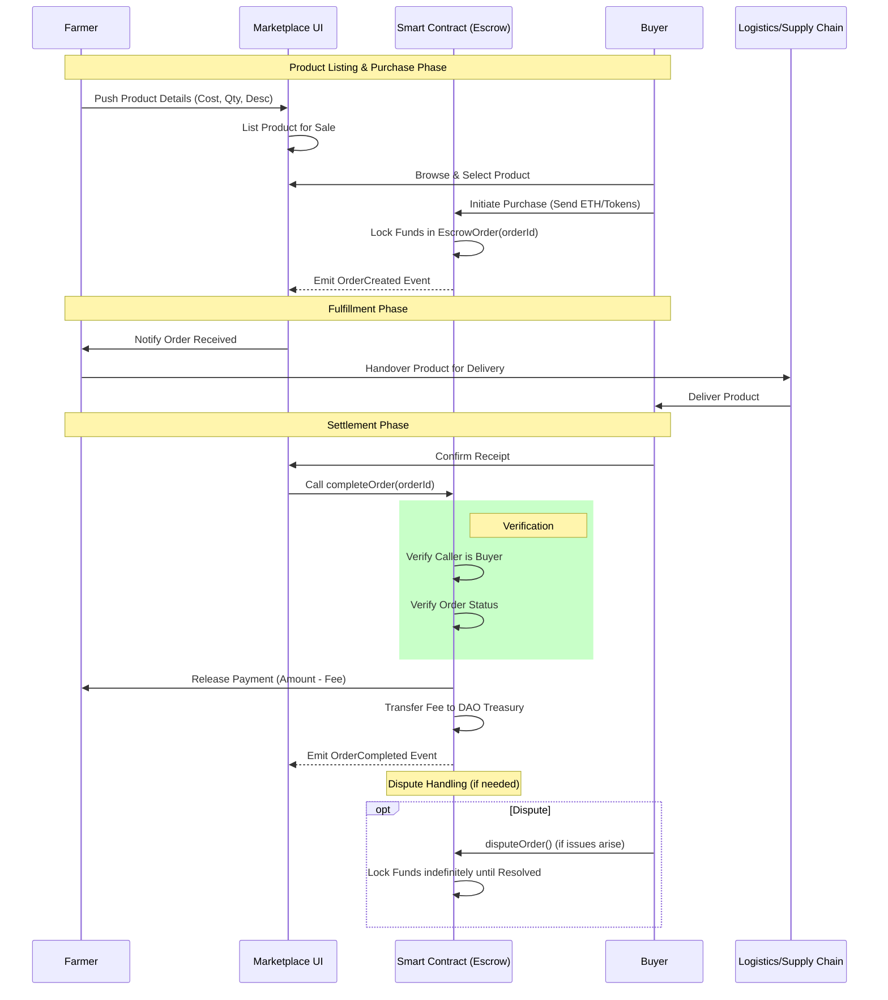

# AgriDAO Supply Chain Flow

This diagram illustrates the flow of a product from the Farmer to the Buyer, including the role of the Marketplace and the DAO Escrow system.

## Flow Description

1.  **Listing**: Farmer pushes product details to the marketplace.
2.  **Purchase**: Buyer buys the product; funds are sent directly to the `MarketplaceEscrow` smart contract.
3.  **Escrow**: Funds are locked. The contract ensures neither party can access them unilaterally during transit.
4.  **Delivery**: Product moves through the supply chain.
5.  **Completion**: Buyer confirms receipt. The smart contract releases funds to the Farmer (minus platform fee) and sends fees to the DAO.
